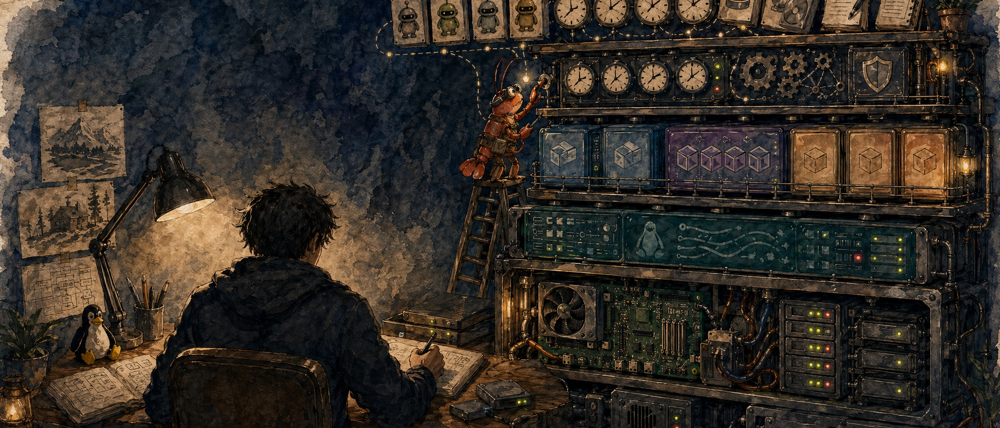

<p align="center">
  
</p>

<h1 align="center">🦞 Solomon's Guide to Cookin' with Gas</h1>

<p align="center">
  <strong>How one engineer runs a 24/7 multi-agent AI stack on bare metal.</strong>
</p>

<p align="center">
  <em>Opinionated. Dogfooded. Broken-and-fixed in production. Tested in service.</em>
</p>

<p align="center">
  
  
  
  
  
  
</p>

<p align="center">
  🦞 No fluff. No theory without implementation. Every guide documents what was actually deployed, how to verify it, and what broke along the way.
</p>

## What this is

This is a working cookbook for one specific stack: a single-engineer setup that runs an always-on multi-agent AI orchestrator on bare-metal Linux, with a homelab behind it for self-hosting, security tooling, content publishing, and knowledge management.

It is **not** a framework, not a product, not a tutorial series. It is a record of what is actually deployed, why each piece is shaped the way it is, and what broke along the way. Lift any single piece. Adopt the whole thing. Or use it as a counterexample. All three are valid.

The agent layer runs on [OpenClaw](https://github.com/openclaw/openclaw), but the patterns generalize. Most of the guides below would apply with light adaptation to [Hermes Agent](https://github.com/agnos-ai/hermes), Claude Code's agent SDK, or any orchestrator that wraps a real LLM with real tools.

## The stack at a glance

```
                    ┌─────────────────────────────────────┐
                    │   Bare metal Linux (single host)    │
                    │   Local LLM stack + agents          │
                    └────────────────┬────────────────────┘
                                     │
       ┌─────────────────────────────┼─────────────────────────────┐
       │                             │                             │
   ┌───▼──────┐               ┌──────▼──────┐                ┌─────▼─────┐
   │ Homelab  │               │ Automation  │                │ Publishing │
   │ (LXC/VM) │               │ (cron/n8n)  │                │ pipeline   │
   └──────────┘               └─────────────┘                └────────────┘
       │                             │                             │
   ┌───▼─────────┐         ┌─────────▼─────────┐         ┌─────────▼─────┐
   │ Self-host:  │         │ Cron, hooks,      │         │ Blog, social, │
   │ media, NAS, │         │ sandbox shims,    │         │ X articles,   │
   │ security    │         │ scheduled jobs    │         │ portfolio     │
   └─────────────┘         └───────────────────┘         └───────────────┘
```

## Recommended Provider Stack

The guides assume a specific provider mix. You can substitute, but if you want a known-good baseline:

- **Codex Pro ($200/mo) OAuth: main agent + coder.** This is the happy path. One flat subscription covers orchestration, code generation, and most cron work. Codex OAuth slots cleanly into OpenClaw's primary-model path and has been the most stable surface across the 2026.4.x releases. Start here.
- **Claude Opus via ACP: escalation only.** Resume, intel, design, review, humanize, academic work. Run it through the ACPX plugin, not as a direct OpenClaw provider.
- **Ollama (free): embeddings, commit messages, triage.** Local, fast, no round-trip.

### ⚠️ Do not route Claude Max OAuth directly through OpenClaw

As of April 2026, pointing an OpenClaw agent at your Claude Max subscription OAuth has two problems that make it a non-starter:

1. **Extra usage charges.** Anthropic started metering traffic that arrives through third-party harnesses against your subscription in ways that show up as additional usage on top of normal Max caps. You can burn through quota far faster than the same work would cost through the first-party Claude client.
2. **System-prompt-level blocking.** Claude detects that it's running inside a non-Anthropic harness and injects guidance that degrades behavior (refusals, hedging, dropping tool calls). Prompt-level workarounds don't stick.

**The only sensible path to Opus from OpenClaw is ACP.** The ACPX plugin launches the official Claude Code CLI as a subprocess. Anthropic's own client handles the OAuth handshake, so the usage accounting and system-prompt behavior stay normal. OpenClaw connects to it over the Agent Client Protocol and treats the session as an escalation sub-agent.

Full migration runbook in [claude-cli → ACP Migration](ai-stack/claude-cli-to-acp-migration.md).

## Quick start

There is nothing to install. This is a collection of standalone guides. Pick the one that solves a problem you have right now:

- **[automation/cron-patterns.md](automation/cron-patterns.md)**: decide which layer (systemd, agent cron, n8n) each scheduled task in your stack actually belongs in
- **[ai-stack/multi-model-orchestration.md](ai-stack/multi-model-orchestration.md)**: wire one orchestrator across many models with the right model per task
- **[security/linux-hardening.md](security/linux-hardening.md)**: UFW, SSH hardening, fail2ban, and defense in depth for the host
- **[infrastructure/backup-recovery.md](infrastructure/backup-recovery.md)**: restic to NAS + cloud, twice daily, with snapshot mounts

## Guides

### AI agent stack

| Guide | Description | Platform |
|-------|-------------|----------|
| [Multi-Model Orchestration](ai-stack/multi-model-orchestration.md) | Run GPT 5.4, ACP Opus, browser-LLM skills, and Ollama in one setup with the right model per task | Any |
| [claude-cli → ACP Migration](ai-stack/claude-cli-to-acp-migration.md) | Move Opus off the main-agent slot after Anthropic's April 2026 subscription-OAuth block | Anthropic |
| [Claude Code via ACP](ai-stack/acp-claude-code.md) | Running Claude Code as an ACP-driven escalation agent after Anthropic's April 2026 harness block | Any |
| [Sub-Agent Patterns](ai-stack/sub-agent-patterns.md) | Spawn patterns, model assignment, ACP escalation, error handling, and the wrapper script | Any |
| [GPT 5.4 Orchestration](ai-stack/gpt-54-orchestration.md) | Tool-call narration guard, strict-agentic detection gaps, silent-tool-loop triage, action-verb tuning | Any |
| [Self-Improving Agents](ai-stack/self-improving-agents.md) | Correction capture, behavioral-guard plugins (tool-narration-guard, tokenjuice), daily memory sweeps, promotion rules | Any |
| [Session Management](ai-stack/session-management.md) | Why single-chat apps bottleneck your agent, Discord channel layouts, cron isolation, and the hybrid approach | Any |
| [Skills Development](ai-stack/skills-development.md) | Write custom skills, structure for discoverability, real-world examples, and skill management | Any |
| [Prompt Caching](ai-stack/prompt-caching.md) | Cache hygiene across Anthropic and OpenAI, so you avoid silent cost/quota leaks | Any |
| [Compaction & Context Tuning](ai-stack/compaction-and-context-tuning.md) | Compaction, memory flush, context pruning, and session search for long-running agents | Any |

### Automation

| Guide | Description | Platform |
|-------|-------------|----------|
| [Cron Patterns](automation/cron-patterns.md) | The three-layer cron stack: systemd timers vs agent cron vs n8n schedule triggers, where each scheduled task belongs | Any |
| [OpenClaw Cron Deep-Dive](automation/openclaw-cron-deep-dive.md) | Heartbeat batching, thinking-budget aliases, explicit delivery routing, quiet hours, and real-incident gotchas | OpenClaw |
| [Multi-Channel Setup](automation/multi-channel-setup.md) | Discord, Telegram, Signal routing, session isolation, ACP threads, and access control | Any |
| [Hooks](automation/hooks.md) | Three-layer hook model: boundary (git pre-push, publish CLIs), tool-call (PreToolUse/PostToolUse, OpenClaw `before_tool_call`/`tool_result_persist`), lifecycle (SessionStart, `before_prompt_build`, `message_sending`) | Any |
| [n8n Patterns](automation/n8n-patterns.md) | Three interfaces (n8n-ops-mcp, REST API, direct sqlite), Code node sandbox + task-runner constant-folding trap, failure-classifier topology | n8n |

### Infrastructure

| Guide | Description | Platform |
|-------|-------------|----------|
| [Backup & Recovery](infrastructure/backup-recovery.md) | Restic to NAS + Google Drive, twice-daily schedule, snapshot mounts, and disaster recovery | Any |
| [Upgrade Hygiene](infrastructure/upgrade-hygiene.md) | Surviving `openclaw update`: systemd regeneration, dist patches, OAuth sync, schema drift | Any |

### Knowledge management

| Guide | Description | Platform |
|-------|-------------|----------|
| [Memory & Token Optimization](knowledge/memory-token-optimization.md) | Three-tier memory architecture with local semantic search and 50-100x token reduction | Any |
| [Claude Code Memory Handoffs](knowledge/claude-code-memory-handoffs.md) | Cross-machine sync format and auto-promoting ingester that keeps OpenClaw the canonical memory owner | Any |
| [Memory Architecture](knowledge/memory-architecture.md) | Operating model: memory as point-in-time claims (not live state), trust hierarchy, write/verify/decay loops, cross-store reconciliation | Any |

### Security

| Guide | Description | Platform |
|-------|-------------|----------|
| [Linux Hardening](security/linux-hardening.md) | UFW, SSH hardening, fail2ban, service binding, and defense-in-depth for an OpenClaw host | Ubuntu 24.04 |
| [WSL2 Hardening](security/wsl-hardening.md) | Windows Firewall, RDP/SSH/SMB lockdown, port proxy hygiene, sleep prevention, and dual-OS defense | Windows 11 + WSL2 |
| [Agent Security](security/agent-security-hardening.md) | API gateway isolation, RBAC, sandboxing, circuit breakers, and a real post-mortem from a sub-agent nuking a database | Any |

### Hardware *(planned)*

The physical layer: choosing the box, partitioning the disk, deciding what the host OS owns vs what gets virtualized. See [`hardware/`](hardware/).

### Publishing *(planned)*

Blog → social fan-out, X articles, content scrubbing, the full pipeline. See [`publishing/`](publishing/).

### Tools *(planned)*

Index of MCP servers, dashboards, and helpers shipped from this stack. See [`tools/`](tools/).

### Philosophy *(planned)*

Why this stack is shaped the way it is. What I won't do. See [`philosophy/`](philosophy/).

## Templates

Drop-in artifacts you can lift without adopting the whole thing. See [`templates/`](templates/).

| Template | Used by |
|----------|---------|
| [`templates/cron/`](templates/cron/) | systemd timer, agent cron, n8n schedule trigger skeletons, paired with [`automation/cron-patterns.md`](automation/cron-patterns.md) |
| [`templates/hooks/`](templates/hooks/) | git pre-push, Claude Code PostToolUse, OpenClaw sync plugin skeletons, paired with [`automation/hooks.md`](automation/hooks.md) |

## Who This Is For

Engineers running an always-on AI agent on real infrastructure: bare metal, VPS, homelab, or enterprise. If you have an agent that has access to your systems, you need to lock it down properly. These guides assume you're comfortable with Linux administration and want actionable steps, not blog posts.

> 🦞 *Built by an engineer who runs this stack 24/7 on bare metal and broke everything at least once so you don't have to.*

## Guide format

Every guide follows the same skeleton. See [CONTRIBUTING.md](CONTRIBUTING.md) for the full template:

1. **What this is** and who it's for
2. **Why this way**: tradeoffs vs the obvious alternatives
3. **Prerequisites**
4. **Before / After**
5. **Implementation** with real commands
6. **Verification** commands you can run right now
7. **Gotchas** from real deployments
8. **Templates + Related** cross-links

Reference implementation: [`automation/cron-patterns.md`](automation/cron-patterns.md).

## Contributing

PRs welcome. See [CONTRIBUTING.md](CONTRIBUTING.md). Two non-obvious rules:

1. **No personal hostnames or IPs in committed text.** Use generic terms.
2. **Every guide ends with a Gotchas section.** If nothing broke, the guide is incomplete.

A pre-push hook ships at [`hooks/pre-push`](hooks/pre-push) that runs [content-guard](https://github.com/solomonneas/content-guard) over the working tree to catch leaks before they hit the remote. Activate after cloning:

```bash
git config core.hooksPath hooks
```

## Related projects

- [OpenClaw](https://github.com/openclaw/openclaw): the AI agent framework this stack runs on
- [content-guard](https://github.com/solomonneas/content-guard): the policy-driven scanner used by the pre-push hook
- [ops-deck-oss](https://github.com/solomonneas/ops-deck-oss): self-hosted ops dashboard
- [n8n-ops-mcp](https://github.com/solomonneas/n8n-ops-mcp), [jellyfin-mcp](https://github.com/solomonneas/jellyfin-mcp), [mcporter](https://github.com/solomonneas/mcporter): MCPs from this stack
- [openclaw-overlay](https://github.com/solomonneas/openclaw-overlay): HUD overlay for session monitoring
- [usage-tracker](https://github.com/solomonneas/usage-tracker): token usage and cost analytics

## License

- Code, scripts, and templates: [MIT](LICENSE)
- Narrative content (guides, manifestos, prose): [CC BY-NC-ND 4.0](CONTENT-LICENSE) 🦞
